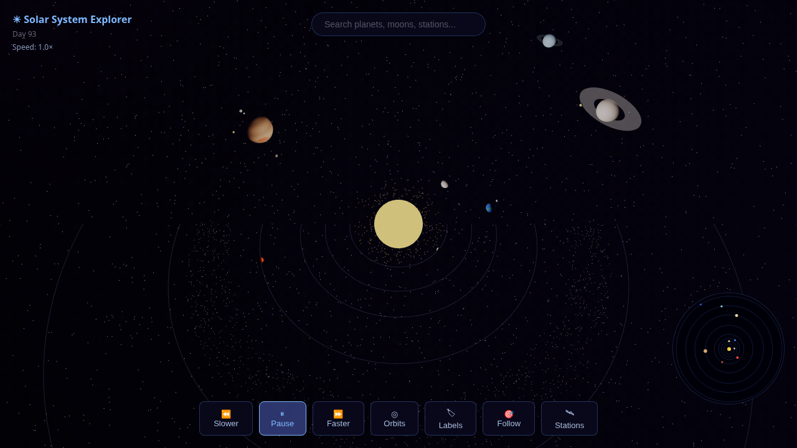
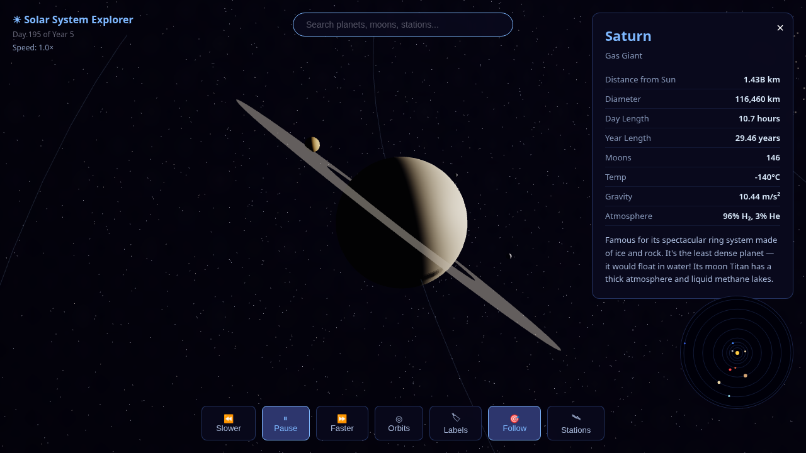
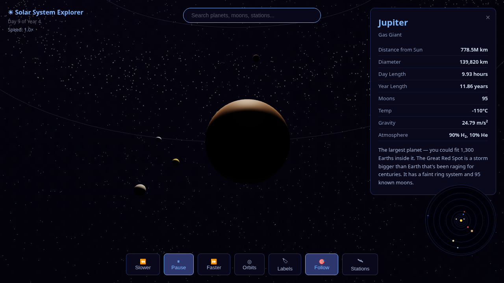
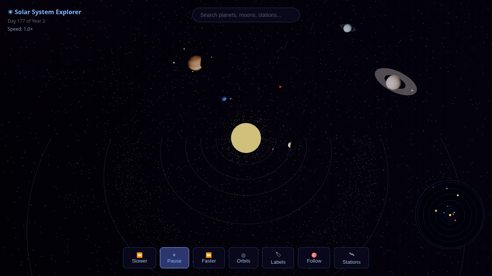
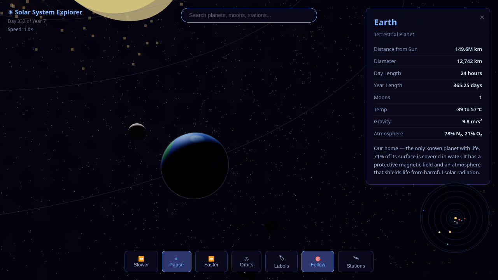

# 🪐 Solar System Explorer

**[🌐 Live Demo](https://marrowleaf.github.io/solar-system/)** — Open in your browser, no install needed.

An interactive 3D solar system simulation built with Three.js. Explore the Sun, all 8 planets, their moons, asteroids, and real space stations — right in your browser.











  

## ✨ Features

- **3D Solar System** — All 8 planets orbiting the Sun with accurate relative sizes, distances, and orbital speeds
- **Planet Info Panels** — Click any planet for real stats: diameter, temperature, gravity, atmosphere, and description
- **Search** — Find any planet or station instantly
- **Space Stations** — ISS, Tiangong, Hubble, James Webb, and Lunar Gateway orbiting in real-time
- **Moons** — Earth's Moon, Jupiter's Galilean moons, Saturn's Titan/Enceladus/Mimas
- **Asteroid Belt & Kuiper Belt** — Thousands of procedurally generated objects
- **Nebula Background** — Atmospheric deep-space backdrop with starfield
- **Camera Controls** — Free roam with orbit controls, click-to-follow any body
- **Time Controls** — Play, pause, speed up (2×, 5×, 10×), slow down, or reverse time
- **Orbit Paths** — Toggle orbit lines on/off
- **Labels** — Toggle planet/station name labels
- **Minimap** — Bottom-right overhead view of the entire system

## 🚀 Quick Start

Just open `index.html` in a browser. No build step, no dependencies to install.

**[🌐 Try it live](https://marrowleaf.github.io/solar-system/)**

Or run locally:

```bash
# Clone it
git clone https://github.com/Marrowleaf/solar-system.git
cd solar-system

# Open it
open index.html            # macOS
xdg-open index.html        # Linux
start index.html           # Windows
```

Or use a local server:

```bash
python -m http.server 8000    # Python
npx serve .                   # Node.js
```

## 🎮 Controls

| Control | Action |
|---------|--------|
| **Left click + drag** | Orbit camera |
| **Right click + drag** | Pan camera |
| **Scroll wheel** | Zoom in/out |
| **Click a planet** | Show info panel & follow |
| **Search bar** | Find any body by name |
| **Bottom controls** | Play/pause, speed, toggle orbits/labels/stations |

## 🌍 What's Included

### Planets
Mercury, Venus, Earth, Mars, Jupiter, Saturn, Uranus, Neptune — each with real-world stats, descriptions, and accurate axial tilts.

### Moons
Luna (Earth), Io/Europa/Ganymede/Callisto (Jupiter), Titan/Enceladus/Mimas (Saturn).

### Space Stations & Telescopes
- **ISS** — Orbiting Earth at 408 km
- **Tiangong** — China's space station
- **Hubble** — The legendary space telescope
- **James Webb** — At the L2 Lagrange point
- **Lunar Gateway** — Planned station orbiting the Moon

### Visual Effects
- Sun glow and lens flare
- Saturn and Uranus ring systems
- Procedural asteroid belt (between Mars & Jupiter)
- Kuiper belt (beyond Neptune)
- Colour-variant starfield (12,000 stars with warm/blue/white tones)
- Nebula background clouds

## 🛠️ Tech

- **Three.js** — WebGL 3D rendering (loaded via CDN)
- **Pure HTML/CSS/JS** — No build tools, no frameworks, no bundling
- **Single file architecture** — `index.html` + `main.js` = the entire app

## 📝 License

MIT — see [LICENSE](LICENSE) for details.

---

Built by [Marrowleaf](https://github.com/Marrowleaf) 🌌